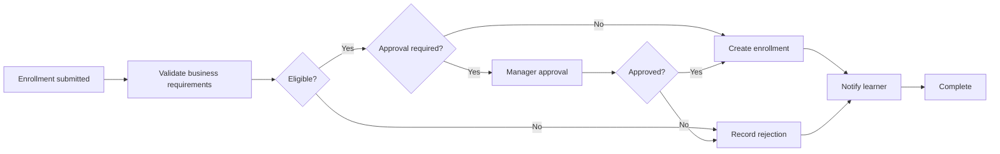

# LearnFlow LMS

LearnFlow is a portfolio-ready learning-management application built with
**C#/.NET 8**, **ASP.NET Core**, **React/TypeScript**, and **Camunda 8**. It
demonstrates how automated tests can verify that enrollment behavior meets
defined business requirements.

The delivered folder is intended to be located at:

```text
C:\LearnFlow
```

## What the application does

- Displays a course catalog and learner directory.
- Accepts course-enrollment requests.
- Uses Camunda BPMN to coordinate validation, manager approval, enrollment,
  rejection, and learner notification.
- Runs .NET job workers for Camunda service tasks.
- Displays each business-rule result and the enrollment audit history.
- Lets an LMS manager approve or deny enrollment requests.
- Includes xUnit and Moq tests focused on expected business behavior.
- Includes a local demo mode when Camunda is intentionally not running.

## Technology

| Area | Technology |
| --- | --- |
| Backend | C#, .NET 8, ASP.NET Core Minimal API |
| Workflow | Camunda 8, BPMN, Orchestration Cluster REST API |
| Frontend | React, TypeScript, Vite |
| Testing | xUnit, Moq, coverlet |
| API documentation | Swagger/OpenAPI |
| Automation | GitHub Actions |

## Business requirements covered by unit tests

An enrollment is eligible only when:

1. The course is active.
2. The learner does not already have an active request for the course.
3. The course has an available seat.
4. The learner completed every prerequisite.

The tests assert these outcomes directly. They do not merely test private
methods or framework behavior.

## Prerequisites

- .NET 8 SDK
- Node.js 20 or newer
- Java 21 or newer
- Camunda 8 Run 8.9 for the full workflow

Camunda 8 Run is intended for local development and prototyping. LearnFlow uses
its REST API at `http://localhost:8080/v2/`.

Official references:

- [Camunda 8 Run developer quickstart](https://docs.camunda.io/docs/self-managed/quickstart/developer-quickstart/c8run/)
- [Camunda Orchestration Cluster REST API](https://docs.camunda.io/docs/apis-tools/orchestration-cluster-api-rest/orchestration-cluster-api-rest-overview/)

## Start with Camunda 8

### 1. Start Camunda

From your Camunda 8 Run directory:

```powershell
.\c8run.exe start
```

Verify the orchestration API:

```powershell
Invoke-RestMethod http://localhost:8080/v2/topology
```

### 2. Start LearnFlow

```powershell
Set-Location C:\LearnFlow
.\Start-LearnFlow.ps1
```

The API automatically deploys `process\course-enrollment.bpmn` and starts the
.NET workers.

Open:

- Application: `http://localhost:5173`
- Swagger: `http://localhost:5192/swagger`
- Camunda Operate: `http://localhost:8080/operate`
- Camunda Tasklist: `http://localhost:8080/tasklist`

## Start without Camunda

To explore the LMS interface while the workflow engine is offline:

```powershell
Set-Location C:\LearnFlow
.\Start-LearnFlow.ps1 -DemoMode
```

Demo mode executes the same C# business rules and follows the same logical
process, but it does not create Camunda process instances.

## Run each component manually

Backend:

```powershell
Set-Location C:\LearnFlow
dotnet restore .\LearnFlowLms.sln
dotnet test .\LearnFlowLms.sln
dotnet run --project .\src\LearnFlow.Api
```

Frontend:

```powershell
Set-Location C:\LearnFlow\client
npm install
npm run dev
```

## Camunda process

The BPMN file can be opened in Camunda Modeler:

```text
C:\LearnFlow\process\course-enrollment.bpmn
```

Process flow:



## Project structure

```text
C:\LearnFlow
├── src
│   ├── LearnFlow.Domain
│   ├── LearnFlow.Application
│   ├── LearnFlow.Infrastructure
│   └── LearnFlow.Api
├── tests
│   └── LearnFlow.UnitTests
├── client
├── process
│   └── course-enrollment.bpmn
├── docs
└── Start-LearnFlow.ps1
```

See `docs\architecture.md` for the component and sequence diagrams.

## Important configuration

`src\LearnFlow.Api\appsettings.json` enables Camunda by default:

```json
{
  "Camunda": {
    "Enabled": true,
    "BaseUrl": "http://localhost:8080/v2/"
  }
}
```

No Azure services or Azure configuration are used by this project.
