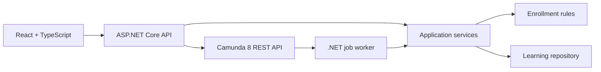
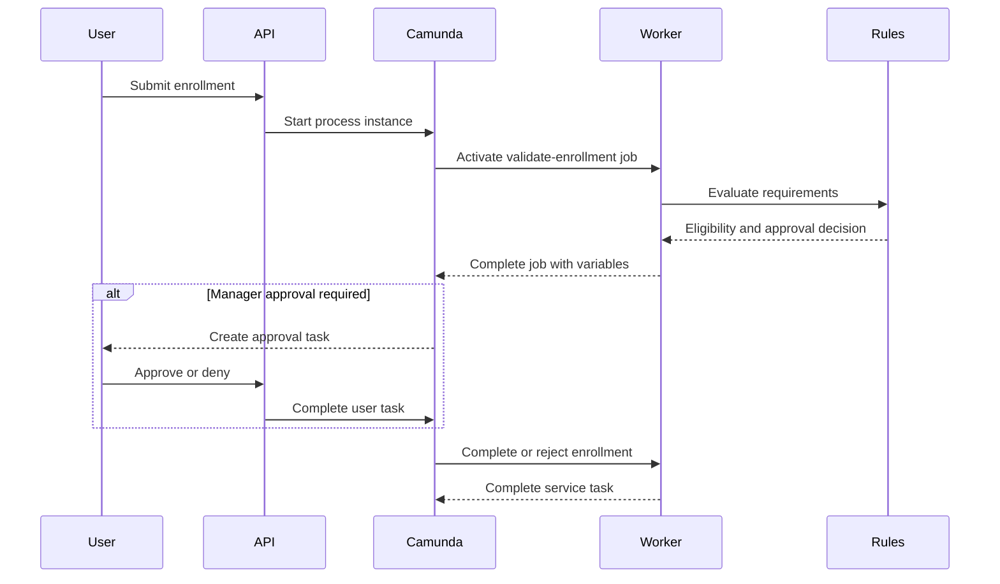

# LearnFlow architecture

LearnFlow separates business behavior from process orchestration:

## Responsibilities

| Component | Responsibility |
| --- | --- |
| `LearnFlow.Domain` | Course, learner, enrollment, and testable business rules |
| `LearnFlow.Application` | Use cases, API contracts, and workflow-task processing |
| `LearnFlow.Infrastructure` | Camunda REST client, workers, deployment, and repository |
| `LearnFlow.Api` | HTTP endpoints, dependency injection, configuration, and Swagger |
| `client` | Learning dashboard, catalog, requests, approvals, and rule visibility |
| `process` | Executable Camunda 8 BPMN model |
| `tests` | xUnit and Moq verification of business behavior |

## Enrollment sequence

## Why the business rules are outside BPMN

Camunda determines *when* work happens and what path the process follows. The
C# domain service determines *whether* the enrollment satisfies business
requirements. This keeps the rules:

- independently testable with xUnit;
- reusable outside a single process model;
- easy to review with business stakeholders;
- isolated from transport and workflow-engine details.
